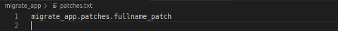
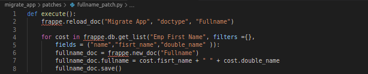

# Migration Code

<h4>The Migration Code write to make changes in Database, This code is executed one time only when the <u>bench migrate</u> command is run</h4>

  <h3>The following steps show you how to write and add any migration code</h3>
  <ol>
    <li> Create <b>pathces</b> Folder in App Folder </li>
    <li> Save the migration code file in the patches folder </li>
    <li> 
      Don't Forget Add the Migration code file to <b>pathces.txt</b>File, Like this
       
      
    </li>
    <li> Running <u>bench migrate</u> command </li>
  </ol>
  <h6> This image shows you the migration code that is used to add the data of some table to another table.</h6>
    

